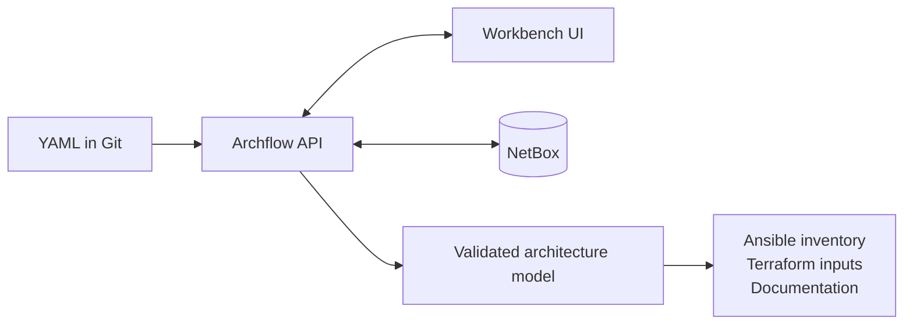

# Archflow Architecture

## Table of contents

- [Purpose](#purpose)
- [Architecture at a glance](#architecture-at-a-glance)
- [Core responsibilities](#core-responsibilities)
- [How the platform works](#how-the-platform-works)
- [Boundary decisions](#boundary-decisions)
- [Example model](#example-model)
- [Related docs](#related-docs)

## Purpose

This document describes the stable, high-level architecture of Archflow. It
focuses on the boundaries that matter most: visual design, NetBox-backed
operations, and generated outputs for Ansible and Terraform.

## Architecture at a glance

Archflow connects visual infrastructure design with operational backend systems
and implementation outputs.

- YAML in Git is the source of truth.
- The workbench UI projects and edits the model.
- NetBox is the operational backend for inventory and infrastructure state.
- The platform generates inventory and IaC-oriented outputs.

## Core responsibilities

| Part | Responsibility | Notes |
| --- | --- | --- |
| YAML model | Stores architecture intent in Git | Source of truth for design data |
| API layer | Loads, validates, saves, and serves the model | Keeps the platform UI-independent |
| Workbench UI | Lets users design and review the model visually | A projection over the model |
| NetBox integration | Synchronizes inventory and infrastructure state | Operational backend, not the source of truth |
| Generator layer | Produces Ansible, Terraform, and documentation outputs | Derived artifacts remain reproducible |

## How the platform works

1. Users author architecture intent in YAML and commit it to Git.
2. Archflow services load the model and normalize it into the domain model.
3. Validation checks rules and constraints before downstream actions run.
4. The workbench renders the model and lets users inspect or edit it.
5. NetBox sync publishes selected operational data into NetBox.
6. Generators produce inventory and IaC-oriented outputs for downstream use.

## Boundary decisions

These boundaries are treated as architectural constraints:

- The UI must not become the source of truth.
- NetBox remains the operational backend, not the architecture model itself.
- Generated outputs must remain reproducible and deterministic.
- APIs should remain stable enough to support UI, sync, and generation.
- Model semantics should not be tightly coupled to drawing primitives.

## Example model

A minimal example is available in `examples/minimal.yaml`.
Use it as a shape reference, not as a feature-complete schema.

## Related docs

- `README.md`
- `docs/decisions.md`
- `docs/AGENTS.md`